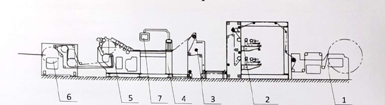
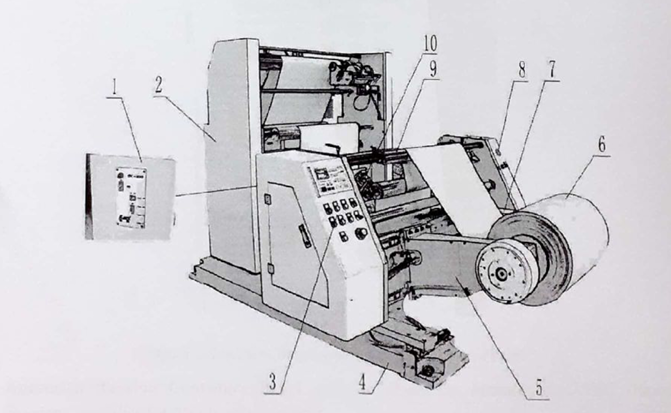
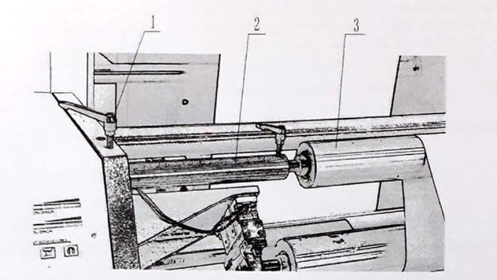
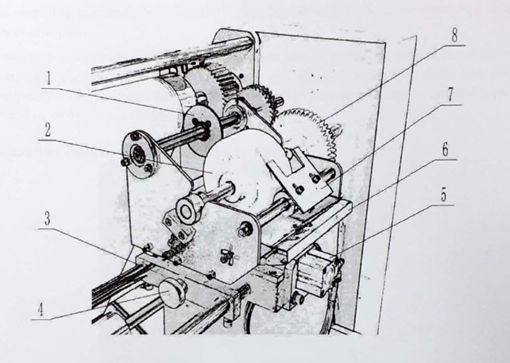
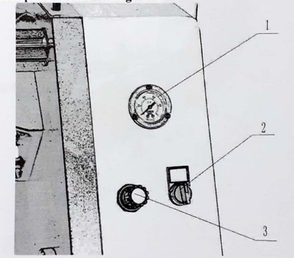
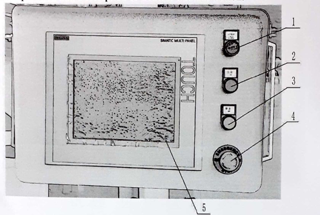
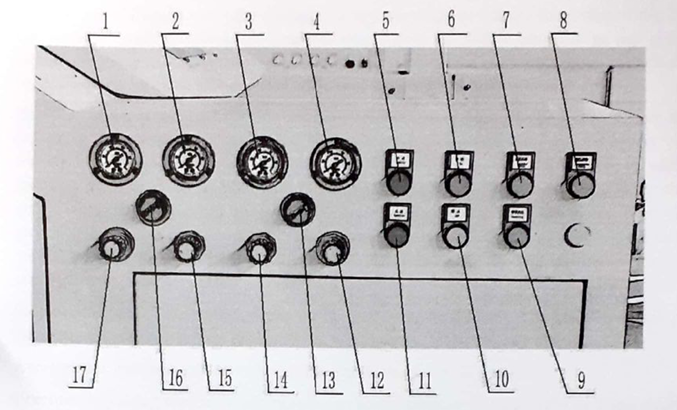
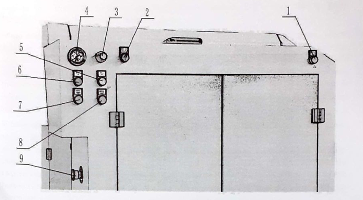

# Operation Manual

# 4 Main Structure and Operation of Machine

  <em>Figure 1. Schematic Diagram of Whole Machine</em> 

1. Unwinding Component 
2. Printing Component 
3. Side Sealing Frame Component 
4. Tube Forming Component 
5. Main Machine Component 
6. Bag Collection Component 
7. Control Component 

## 4.1. Main Structure and Operation of Unwinding Component

  <em>Figure 2. Schematic Diagram of Unwinding Component</em> 

1. Deviation Rectification Panel
2. Side Gluing Frame 
3. Unwinding Operating Panel 
4. Unwinding Machine Frame 
5. Unwinding Arm on Operating Side 
6. Material Reel 
7. Unwinding Arm on Transmission Side 
8.  Side Gluing Operating Panel 
9.  Dancer Roller 
10. Tension Sensor 

### 4.1.1. Main Structure of Unwinding Component 
Unwinding component is mainly constituted by unwinding machine frame (Figure 2-4), unwinding arms (Figure 2-5, 2-7), tension control system and electric control system.

### 4.1.2. Operation of Unwinding Component

#### 4.1.2.1. Function Description for Unwinding Operating Paneln of onwinding Operating Panel

  <em>Figure 3. Schematic Diagram of Unwinding Operating Panel</em> 

1. **Automatic Tension Controller Panel:** refer to Operation Manual of AXTEC Automatic Tension Controller for details of adjustment.
2. **Operating Side Folding Button:** for folding of unwinding arm on operating side.
3. **Material Frame Jointly Folding Button:** for folding of unwinding arms both on operating side and transmission side at the same time.
4. **Material Frame Jointly Unfolding Button:** for unfolding of unwinding arms both on operating side and transmission side at the same time.
5. **Operating Side Unfolding Button:** for unfolding of unwinding arm on operating side.
6. **Stop Button:** used to stop the machine in course of normal operation; and the caution lamp will turn to red from green.
7. **Emergency Stop Button:** hit this button to make machine scram; at this moment any buttons will be invalid. To reset the machine back to normal state, it is necessary to pull out this button, and press Reset Button on touch screen, then the machine can be operated normally.
8. **Transmission Side Unfolding Button:** for unfolding of unwinding arm on transmission side.
9. **Function Selection Knob:** for selecting the function of rising/falling or deviation rectification of unwinding arm.
10. **Material Frame Rising/Falling Knob:** for selecting the function of rising or falling of unwinding arm.
11. **Transmission Side Folding Button:** for folding of unwinding arm on transmission side.

#### 4.1.2.2. Loading and Unloading of Material Reel

(A) It is appropriate to adjust the unwinding arms on operating side and transmission side properly when new reel is being installed for the first time, so as to make these two arms symmetrical with the center of unwinding frame. Ensure that the material reel can be in the middle of the machine after installation.
(B) Press Material Frame Jointly Unfolding Button according to the width of material reel (Figure 3-4), to adjust the unwinding arms to the positions where the material pushing cone head is slightly wider than the material reel core.
(C) Measure the distance from the center of material reel to be installed to the ground; press Material Frame Rising/Falling Knob (Figure 3-10) to make the height of the material pushing cone head of unwinding arm from the ground be the distance measured.
(D) Press Material Frame Jointly Folding Button (Figure 3-3) on the operating panel to make the material pushing cone head push tightly the material reel core.
(E) Make the material pass through the machine according to Material Feeding Diagram in Chapter 9; then bags can be produced normally if other components are also ready for production.
(F) When the material reel is fully used up, stop the machine and press Material Frame Jointly
Unfolding Button (Figure 3-4) on the operating panel to make the material pushing cone head quit from the material reel core.

Note:

In course of adjusting unwinding arms and loading/unloading material reel, the operation can be done only after ensuring that there are no personnel or articles in the moving range.

#### 4.1.2.3 Operation of Dancer Roller

  <em>Figure 4. Schematic Diagram of Dance Roller</em> 

When there is loose edge or tight edge of material on the dancer roller (Figure 4-3), the difference can be adjusted via the following specific operation procedure: first loosen locking handle (Figure 4-1); then turn eccentric shaft (Figure 4-2) to the appropriate position and finally fasten locking handle after adjustment (Figure 4-1).

#### 4.1.2.4. Tension Adjustment of Material Reel

Refer to Operation Manual of AXTEC Automatic Tension Controller for details.

#### 4.1.2.5. Deviation Rectification Adjustment of material roll.

Refer to Operation Manual of AIBO EPC System for details.

### 4.3. Main Structure and Operation of Side ealing Frame Component

#### 4.3.1. Main Structure of Side Sealing Frame Component

Side sealing frame component is mainly constituted by side sealing machine frame (Figure 2-2). side gluing component (Figure 5) and side gluing control system.

  <em>Figure 5. Schematic Diagram of Side Gluing Component</em> 

1. Gluing Pulley
2. Glue Transfer Pulley
3. Adjusting Seat
4. Adjusting Hand Wheel
5. Clutch Cylinder
6. Side Glue Plate
7. Side Glue Scrapper
8. Driving Gear for Side Gluing

#### 4.3.2. Operation of Side Gluing Component

This machine adopts glue transfer method for side gluing (Figure 5). Glue transfer pulley dips into the side glue plate (Figure 5-6). The surplus glue is scrapped by side glue scrapper (Figure 5-7). then the remaining glue is transferred onto gluing pulley (Figure 5-1) and then transferred onto raw paper. The driving operation is made by driving gear for side gluing (Figure 5-8).

The separation and reunion between gluing pulley (Figure 5-1) and raw paper are controlled by clutch cylinder (Figure 5-5).

The gluing position of gluing pulley (Figure 5-1) on raw paper can be adjusted by adjusting hand wheel (Figure 5-4).

Note:

(A) Avoid overfilling glue into side glue plate; the height of glue level should not exceed 2/3 of the height of glue plate.

(B) It is necessary to wash the side gluing components in case of getting off work or out of service for long time. First dismantle glue transfer pulley and side glue scrapper to wash; then wash gluing pulley on the machine; finally dismantle side glue plate to pour out the remainder glue, wash and properly place it for next usage.

#### 4.3.3. Function Description of Side Gluing Panel.

  <em>Figure 6. Schematic Diagram of Side Gluing Panel</em> 

1. **Air Source Pressure Gauge:** for indicating air source pressure.
2. **Side Gluing Mode Selection Knob:** used to select a mode for side gluing (manually or automatically).
In manual operation mode, clutch cylinder acts to separate the gluing pulley and raw paper so that glue cannot be applied onto raw paper. This mode is mainly used for adjusting machine.
In automatic operation mode, clutch cylinder acts together with main machine. When main machine starts up, clutch cylinder acts to make the gluing pulley close to raw paper and glue can be applied onto raw paper, when main machine stops, clutch cylinder acts to separate gluing pulley from raw paper, so that glue cannot be applied onto raw paper. This mode is mainly used for normal operation of the machine.
The conversion between these two modes can be made at any time.
3. **Pressure Adjusting Knob:** for adjusting the pressure of air source.

### 4.7. Main Structure and Operation of Control Component

The operation for control part contains two sections. One section is the operation of touch screen, (refer to Touch Screen Operation Manual for details); the other section is the operation and description of operating buttons, which will be described in detail as follows.

#### 4.7.1. Operation and Description of Control Cabinet Buttons

  <em>Figure 28. Schematic Diagram of Touch Screen</em> 

1. **Power Indicator Lamp:** used to indicate the state of the machine power supply.
2. **Start Button:** click Start Button, then the red, green, yellow lamps on the caution lamp will go
on at the same time and the buzzer will ring for 3 seconds; after the ring of buzzer, the yellow lamp will go on within 2 seconds, which indicates the machine will start up normally by clicking Start Button for the second time within the two seconds. If it is made, then the green lamp will go on while the yellow lamp will go out.
3. **Stop Button:** click Stop Button to stop the normally running machine. The green lamp will go out while the red lamp will go on.
4. **Emergency Stop Button:** hit Emergency Stop Button, the machine will scram and at this moment any buttons will be invalid. When reset the state of emergency stop, it is necessary to pull out the emergency stop button. The machine can be operated normally only after pressing
the reset button on the touch screen.
5. **Touch Screen:** used for inputting and displaying the parameters of the machine. Refer to Touch Screen Operation Manual for details.

### 4.7.2. Operation and Description of Front Panel Buttons

  <em>Figure 29. Schematic Diagram of Front Panel</em> 

1. **Air Source Pressure Gauge:** used for indicating the air source pressure of air cylinder on operating side of the second material traction pressing roller.
2. **Air Source Pressure Gauge:** used for indicating the air source pressure of air cylinder on transmission side of the second material traction pressing roller.
3. **Air Source Pressure Gauge:** used for indicating the air source pressure of air cylinder on operating side of the first material traction pressing roller.
4. **Air Source Pressure Gauge:** used for indicating the air source pressure of air cylinder on transmission side of the first material traction pressing roller.
5. **Acceleration Button:** accelerate the machine when this button is pressed.
6. **Start Button:** click Start Button, then the red, green, yellow lamps on the caution lamp will go on at the same time and the buzzer will ring for 3 seconds; after the ring of buzzer, the yellow lamp will go on within 2 seconds, which indicates the machine will start up normally by clicking Start Button for the second time within the two seconds. If it is made, then the green lamp will go on while the yellow lamp will go out.
7. **Main Motor Inching Button:** click Main Motor Inching Button, then the red, green, yellow lamps on the caution lamp will go on at the same time and the buzzer will ring for 3 seconds; after the ring of buzzer, the yellow lamp will go on within 2 seconds, which indicates the main motor will run at the inching speed by pressing and holding this button within the two seconds, meanwhile the green lamp will go on while the yellow lamp will go out. If this button is released later, then the main motor will stop, and the red lamp will go on while the green lamp will go out. This button is mainly used for inching the main motor.
8. **Whole Machine Inching Button:** click Whole Machine Inching Button, then the red, green,yellow lamps on the caution lamp will go on at the same time and the buzzer will ring for 3 seconds; after the ring of buzzer, the yellow lamp will go on within 2 seconds, which indicates the whole machine will run at the inching speed by pressing and holding this button within the two seconds, meanwhile the green lamp will go on while the yellow lamp will go out. If this button is released later, then the whole machine will stop, and the red lamp will go on while the green lamp will go out. This button is mainly used for inching the whole machine.
9. **Traction Servo Motor Inching button:** click Traction Servo Motor Inching Button, then the red, green, yellow lamps on the caution lamp will go on at the same time and the buzzer will ring for 3 seconds; after the ring of buzzer, the yellow lamp will go on within 2 seconds, which indicates the traction servo motor will run at the inching speed by pressing and holding this button within the two seconds, meanwhile the green lamp will go on while the yellow lamp will go out. If this button is released later, then the traction servo motor will stop, and the red lamp will go on while the green lamp will go out. This button is mainly used for inching the traction servo motor.
10. **Stop Button:** click Stop Button to stop the normally running machine. The green lamp will go out while the red lamp will go on.
11. **Acceleration Button:** decelerate the machine while this button is pressed.
12. **Pressure Adjusting Knob:** for adjusting the air source pressure of air cylinder on transmission side of the first material traction pressing roller.
13. **Conversion knob:** used as clutch conversion knob of first traction roller.
14. **Pressure Adjusting Knob:** for adjusting the air source pressure of air cylinder on operating side of the first material traction pressing roller.
15. **Pressure Adjusting Knob:** for adjusting the air source pressure of air cylinder on transmission side of the second material traction pressing roller.
16. **Conversion knob:** used as clutch conversion knob of second traction roller.
17. **Pressure Adjusting Knob:** for adjusting the air source pressure of air cylinder on operating side of the second material traction pressing roller.

### 4.7.3. Operation and Description of Rear Panel Buttons

  <em>Figure 30. Schematic Diagram of Rear Panel</em> 

1. **Whole Machine Inching Button:** click Whole Machine Inching Button, then the red, green, yellow lamps on the caution lamp will go on at the same time and the buzzer will ring for 3 seconds; after the ring of buzzer, the yellow lamp will go on within 2 seconds, which indicates the whole machine will run at the inching speed by pressing and holding this button within the two seconds, meanwhile the green lamp will go on while the yellow lamp will go out. If this button is released later, then the whole machine will stop, and the red lamp will go on while the green lamp will go out. This button is mainly used for inching the whole machine.
2. **Bottom Gluing Mode Selection Knob:** used to select a mode for bottom gluing (manually or automatically). In manual operation mode, clutch cylinder acts to separate the gluing pulley and raw paper so that glue cannot be applied onto raw paper. This mode is mainly used for adjusting machine. In automatic operation mode, clutch cylinder acts together with main machine. When main machine starts up, clutch cylinder acts to make the gluing pulley close to raw paper and glue can be applied onto raw paper, when main machine stops, clutch cylinder acts to separate gluing pulley from raw paper, so that glue cannot be applied onto raw paper. This mode is mainly used for normal operation of the machine. The conversion between these two modes can be made at any time.
3. **Pressure Adjusting Knob:** for adjusting the air source pressure of air cylinder in the bottom gluing part.
4. **Air Source Pressure Gauge:** for indicating the air source pressure of air cylinder in the bottom gluing part.
5. **Stop Button:** click Stop Button to stop the normally running machine. The green lamp will go out while the red lamp will go on.
6. **Start Button:** click Start Button, then the red, green, yellow lamps on the caution lamp will go on at the same time and the buzzer will ring for 3 seconds; after the ring of buzzer, the yellow lamp will go on within 2 seconds, which indicates the machine will start up normally by clicking Start Button for the second time within the two seconds. If it is made, then the green lamp will go on while the yellow lamp will go out.
7. **Main Motor Inching Button:** click Main Motor Inching Button, then the red, green, yellow lamps on the caution lamp will go on at the same time and the buzzer will ring for 3 seconds; after the ring of buzzer, the yellow lamp will go on within 2 seconds, which indicates the main motor will run at the inching speed by pressing and holding this button within the two seconds, meanwhile the green lamp will go on while the yellow lamp will go out. If this button is released later, then the main motor will stop, and the red lamp will go on while the green lamp will go out. This button is mainly used for inching the main motor.
8. **Whole Machine Inching Button:** click Whole Machine Inching Button, then the red, green, yellow lamps on the caution lamp will go on at the same time and the buzzer will ring for 3 seconds; after the ring of buzzer, the yellow lamp will go on within 2 seconds, which indicates the whole machine will run at the inching speed by pressing and holding this button within the two seconds, meanwhile the green lamp will go on while the yellow lamp will go out. If this button is released later, then the whole machine will stop, and the red lamp will go on while the green lamp will go out. This button is mainly used for inching the whole machine.
9. **Emergency Stop Button:** hit Emergency Stop Button, the machine will scram and at this moment any buttons will be invalid. When reset the state of emergency stop, it is necessary to pull out the emergency stop button. The machine can be operated normally only after pressing the reset button on the touch screen.

