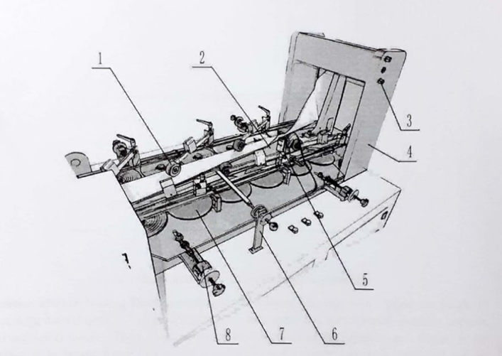

## 4.4. Main Structure and Operation of Tube Forming Component

### 4.4.1 Main Structure of Tube Forming Component

Tube forming component is constituted by tube forming machine frame (Figure 7-4), forming mould component (Figure 7-7) and paper presing pulley component (Figure 7-1)

  <em>Figure 7. Schematic Diagram of Tube Forming Component</em>

1. Paper Pressing Pulley Component
2. Forming Mould Component
3. Locking Screw
4. Tube Forming Machine Frame
5. Contrast Sensor
6. Mould Fixing Bar
7. Side Tucking Disc Component
8. Side Tucking Disc Adjusting Seat

### 4.4.2 Operation of Tube Forming Component

#### Operations of Tube Forming Moulds:
First select a pair of forming moulds of certain size according to the width of bags to be produced and install the forming moulds onto the center of the machine. Then loosen the locking screw (Figure 7-3) on Tube Forming Machine Frame (Figure 7-4), and adjust the position of the lower forming mould to be tangent to material traction pulley (Figure 8). Finally fasten the locking screw after the adjustment (Figure 7-3).

#### Operation of Side Tucking Discs:
According to the adjusted forming mould, adjust the height of side tucking discs (Figure 7-7) (6 groups in total) so as to make it to be the middle position between upper and lower moulds. There is one screw on the lower end of the adjusting seat (Figure 9) for adjusting of the height of side tucking discs. According to the size of bags to be produced, use the adjusting hand wheel on the adjusting seat for adjusting the insertion depth of side tucking discs. The discs will break the paper tube in case of being inserted too deep while make tube forming bad in case of being inserted too shallow. In course of adjusting side tucking discs, the locking nut on the front of adjusting seat (Figure 7-8) should not be locked too tight; otherwise the discs will be unable to be adjusted; the locking nut should not be locked too loose, otherwise the adjustment will be inaccurate. After adjustment fasten the locking nut so as to avoid position deviation due to looseness of nut in course of operation of the equipment.

#### Operation of Paper Pressing Pulleys:
The forming of large and small edges of paper tube is made by stress from paper pressing pulleys (Figure 10). The position of paper pressing pulley is different according to the sizes of different paper bags to be produced; the position of the paper pressing pulley can be adjusted at will by loosening the adjusting handle on the paper pressing pulley; the clump weight on the paper pressing pulley can be increased or decreased according to actual requirements.

#### Operation of Mould Fixing Bar:
When the central line of the paper tube is not identical to that of the machine after the paper tube is output from the forming mould, the forming mould can be fixed onto the central line of the machine, by adjusting the nut on the mould fixing bar (Figure 11).

## 4.5. Main Structure and Operation of Main Machine Component

### 4.5.1. Main Structure of Main Machine Component 
Main machine component (Figure 12) is constituted by main machine frame, material traction part, cutting part, transfer pulley part, line pressing part, bottom opening part, bottom former part, square bottom forming part, bottom gluing part, bottom inserting part, bottom folding part and control part etc.

### 4.5.2. Operation of Main Machine Component

#### 4.5.2.1. Operation of Material Traction Part 
Material traction part is the power source for raw paper to be transferred from unwinding, edge gluing, and tube forming to main machine and is driven by servo motor. Material traction part is mainly constituted by material traction bottom roller and material traction pressing pulley. It is unnecessary to adjust the bottom roller and the adjustment of the pressing pulley (Figure 13-2) is determined by paper bag body width: loosen the locking screw (Figure 13-1) on the pressing pulley, and then transversely move the pressing pulley to make its external side edge be slightly more outside than the paper bag body side edge, and finally fasten the locking screw. Pressure of pressing pulleys are controlled by two air cylinders (Figure 13-3) and adjusted by pressure valve on the main machine panel. The pressure should be between 45-60Pa and adjusted according to different paper and requirements.

1. Locking Screw 
2. Material Traction Pressing Pulley 
3. Air Cylinder

#### 4.5.2.2. Operation of Cutting Part 

1. Cutting Lower Roller 
2. Cutting Upper Roller 
3. Cutter Seat 
4. Cutter 

##### Adjustment of Cutter Position:
Loosen the locking block of gear on cutting upper roller, and then turn the cutting upper roller and lower roller to make the cutter on the upper roller aim at the center of the cutter groove on the lower roller; finally fasten the locking block of gear on cutting upper roller (Figure 14).

##### Adjustment of Cutting Speed:
The cutting speed is adjusted according to the cutting length of paper tube. The rotation speed of cutter is controlled by two eccentric gears. For each eccentric gear there is one point marker on its long shaft and short shaft respectively. When the point marker on the long shaft of driving eccentric gear coincides with the point marker on the short shaft of driven eccentric gear, the speed is highest; when the point marker on the short shaft of driving eccentric gear coincides with the point marker on the long shaft of driven eccentric gear, the speed is lowest. The position of eccentric gear can be adjusted by loosening the screw on the locking block of eccentric gear. Properly adjust the position of eccentric gear according to the cutting length of paper tube and fasten the locking screw (Figure 15).

1. Locking Screw 
2. Locking Block of Eccentric Gear 
3. Eccentric Gear 

#### 4.5.2.3. Operation of Transfer Pulley Part

##### Adjustment of Transfer Pulley Pressure:
The pressure of the transfer pulley can be changed by adjusting slide blocks on its two sides. The pressure must be adjusted appropriately and can be tested by pulling material with hand under the principle of being unable to pull. The horizontal position of the transfer pulley should be adjusted according to the paper -tube width. In principle, the edge of the transfer pulley should not touch the folded part of each side edge of paper tube. 

The position of the transfer pulley notch can be adjusted after loosening the adjusting gear (Figure 16-1).

1. Adjusting Gear
2. Lower Guiding Pulley
3. Transfer Pulley

#### 4.5.2.4. Operation of Line Pressing Part
The adjusting method for pressure and horizontal position is same as that for transfer pulley.
Adjustment of the iron plectrum should be done according to the size of paper tube to be made.
The distance between two pressing lines is half of the bottom size of paper bag to be made. Specific adjusting method is: loosen the screw on the line pressing pulley; the position of the second line can be moved forwards or backwards to the dimension necessary; and then fasten the loose screw.
The adjustment for the distance between the first pressing line and the action point of the first clamp is: loosen the fixing nut on the transmission side of the line pressing pulley; then the position of the first pressing line can be moved forwards or backwards (Figure 17).

#### 4.5.2.5. Operation of Bottom Opening Part 

1. Horizontal Locking Screw on Bottom Opening Rattler 
2. Paper Pressing Bar 
3. Bottom Opening Rattler 
4. Bottom Opening Clamp 
5. Adjusting Handle for Releasing Time Point of Bottom Opening Clamp 

The horizontal position of bottom opening rattler (Figure 18-4) should be adjusted according to the width of paper tube. To make this adjustment, loosen the horizontal locking screw (Figure 18-1) on bottom opening rattler, adjust the rattler’s position horizontally until the edge of the rattler is fundamentally consistent with the edge of paper tube, and then fasten the locking screw. 

There are several kinds of paper pressing bars (Figure 18-2). Select appropriate paper pressing bar according to different paper tube width. Make sure that the height of paper pressing bar does not execed that of bottom opening rattler. 

Releasing time point of bottom opening clamp (Figure 18-4) can be adjusted by the handle_? (Figure 18-5) on two pieces of screws. It becomes later when tuming clockwise while becomes carllcr‘wht:‘n turning anticlockwise. The time is adjusted according to the paper bag bottom width. If the time is too short, the bottom opening will be finished badly; if the time is too long, the bag bottom corner Will be broken due to pulling. 

The method for adjusting the position of bottom opening clamp is: loosen the gear nut on transmission side, and then adjust the bottom opening clamp forwards and backwards until the clamp nips right on the position of the first pressing line. By doing so, there will be perfect bag bottom produced. And finally, fasten the gear nut for normal production. 

#### 4.5.2.6. Operation of Bottom Former Part 

Adjustment of side guiding board: select appropriate side guiding board according to different bag Width. The adjusting principle is that horizontal width should be same as the width of paper bag and the upper part should cover the underside turned over (Figure 19). 
Adjustment of middle guiding bar: the middle guiding bar cannot block the bottom turned over; otherwise the underside will not be unfolded. If the space is too small, one guiding bar shall be enough. 

1. Side Guiding Board 
2. Middle Guiding Bar

#### 4.5.2.7. Operation of Square Bottom Forming Part 
 
1. Central Clamp 
2. Side Clamp 
3. First Clamp 
4. Second Clamp 

Adjustment of central clamp: the position of the base plate where central clamp (Figure 20-1) is installed can be adjusted forwards or backwards by loosening the locking screw on the base plate. The adjusting principle is: the distance between the front end of central clamp and first clamp is approximately the folding length of paper bag bottom deducting 3-4mm (Figure 21). The unfolding height of central clamp can be adjusted by loosening the adjusting arm at one end of central clamp. The adjusting principle is: the height between central clamp and drum pulley surface is about from 16mm to 19mm. The releasing time point of central clamp can be adjusted by two groups of cams on the wallboard on operating side, and will determine the quality of the four corners of bag bottom. 

1. Paper Bag 
2. Central Clamp 
3. Adjusting Arm of Central Clamp 

Adjustment of side clamp: horizontal position of the base plate where side clamp is installed can be adjusted forwards or backwards by loosening the locking block on the base plate. The adjusting principle is: the intersection point between the edge of side clamp and the opening mouth of first clamp should be 3mm more inside than the nearest paper bag side edge. Remember to lock the locking screw after adjustment. The height of side clamp can be adjusted by eccentric shaft on the mounting seat for side clamp. The opening width of side clamp should be larger than the width of paper bag. 

First clamp is the criterion and it is unnecessary to adjust its position. It is only necessary to adjust its opening width, which is usually about 6.5mm. The opening width of first clamp can be adjusted by loosening the screw on the adjusting arm at one end of first clamp. 

Adjustment of second clamp: the distance between the second clamp and the first clamp can be adjusted by loosening the locking screw on the base plate of second clamp. The adjusting principle is: the distance between the second clamp and the first clamp should be about 12mm shorter than the bottom width of paper bag. The opening width of second clamp is usually about 8mm. This width of second clamp can be adjusted by loosening the screw on the adjusting arm at one end of second clamp (Figure 22). 

1. First Clamp 
2. Side Clamp 
3. Second Clamp 

#### 4.5.2.8. Operation of Bottom Gluing Part 
Stick rubber board for gluing before bottom gluing; the size and position of rubber board should be determined by the bag body width and bottom width of paper bag. Shear the rubber board and stick it with double sided tape onto gluing pulley (Figure 23-3). The relative position between the stuck rubber board and paper bag bottom can be changed by adjusting the gear at the end of gluing pulley. The bottom gluing can be started after the completion of adjusting the relative positions of glue dipping pulley. glue transfer pulley, gluing pulley and large hub. The quantity of glue to be applied onto the paper bag bottom should be adjusted by the gaps between different pulleys. 

1. Glue Dipping Pulley 
2. Glue Transfer Pulley 
3. Gluing Pulley 
4. Gluing Rubber Board 

#### 4.5.2.9. Operation of Bottom Inserting Part 
Adjustment of the first slotting tool: tum the large hub until the opening mouth of first clamp is on the connecting line between the slotting tool shaft and the central shaft of large hub. Then loosen the locking screw on the supporting arm of the first slotting tool, and turn the first slotting tool until the cutter on the first slotting tool is inserted into the opening mouth of first clamp. Finally lock the screw to avoid loosing. 

The adjusting method for the second slotting tool is same as above. Usually it is unnecessary to adjust the first slotting tool again after it has been adjusted properly (when the position does not change), while the second slotting tool should be adjusted according to the position of second clamp. 

The insertion depth of the first slotting tool usually is approximately 12mm; the width should be adjusted according to paper bag body width and usually is 6mm shorter than the bag body width; and the two corners of the first slotting tool should be rounding. 

The insertion depth of the second slotting tool is about 13mm and the width should be larger than paper bag width. It is appropriate to use the standard slotting tool equipped with the machine and it is unnecessary to adjust it any more. 

As for the changes of paper quality, the insertion depths of slotting tools may change. So sometimes itis necessary to change the depths of slotting tools as per different paper. 

1. First Slotting Tool 
2. Second Slotting Tool 
#### 4.5.2.10. Operation of Bottom Folding Part 
The position of bottom folding rod can be adjusted by loosening the locking block of the chain wheel at the end of bottom inserting shaft. The adjusting principle is: when second clamp is unfolded, the bottom folding bar should be put right on the position of second clamp, so that the bag bottom can be folded. 

The bottom folding rod is combined by several short nylon bars according to a certain needed width. This width should not be larger than the distance between two protective rods. (There are two protective rods installed below slotting tools to prevent paper bag from falling down when the clamps are released.) Otherwise this bottom folding rod will break these two protective rods.

1. Bottom Folding Bar 
2. Bottom Folding Board 

Adjustment of bottom folding board (Figure 26-3) can be made by loosening the locking screw on bottom folding board. The adjusting principle is: when bottom folding bar has pressed the second folded edge onto the bottom and left from the second folded edge, bottom folding board should touch the first folded edge and press it onto the bottom. 

1. Clutch Cylinder 
2. Clutch Board 
3. Bottom Folding Board 
4. Delivery Pulley 
5. Limit Screws 
6. Large Hub 

Adjustment of the horizontal position of delivery pulley: loosen the locking screw on delivery pulley, adjust it in the horizontal direction until the edge of delivery pulley is 3-6mm more inside than the side edge of paper bag, and finally fasten the locking screw. 

Adjustment of the pressure of delivery pulley: turn the clutch switch of delivery pulley and put the pulley down, then adjust the limit screws on the pulley to some suitable positions. Note that the limits screws on both sides of the pulley should be adjusted at the same time to make sure the balance of the pressure on both side edges of the paper bag. After the adjustment, there should be a certain resistance among the paper bag, delivery pulley and large hub, so that the paper bag cannot be pulled out easily. 

## 4.6. Main Structure and Operation of Bag Collection Component 
Paper bags are delivered by belt, and collected on the side workbench, which is controlled by separate servo motor. Its counting method is that accelerating the belt suddenly when a certain number of bags are collected to make an obvious gap between every two contiguous batches of bags, which is very convenient for collection. Refer to Touch Screen Operation Manual for details. 