# Manual de Operación

## 4.4. Estructura Principal y Operación del Componente de Formación de Tubos

### 4.4.1 Estructura Principal del Componente de Formación de Tubos

El componente de formación de tubos está constituido por el marco de la máquina formadora de tubos (Figura 7-4), el componente del molde formador (Figura 7-7) y el componente de la polea de prensado de papel (Figura 7-1).

  <em>Figura 7. Diagrama Esquemático del Componente de Formación de Tubos</em> 

1. Componente de la Polea de Prensado de Papel
2. Componente del Molde Formador
3. Tornillo de Bloqueo
4. Marco de la Máquina Formadora de Tubos
5. Sensor de Contraste
6. Barra de Fijación del Molde
7. Componente del Disco de Pliegue Lateral
8. Asiento de Ajuste del Disco de Pliegue Lateral

### 4.4.2 Operación del Componente de Formación de Tubos

#### Operaciones de los Moldes de Formación de Tubos:
Primero seleccione un par de moldes de formación de un tamaño específico de acuerdo con el ancho de las bolsas a producir e instale los moldes de formación en el centro de la máquina. Luego, afloje el tornillo de bloqueo (Figura 7-3) en el marco de la máquina formadora de tubos (Figura 7-4) y ajuste la posición del molde inferior para que sea tangente a la polea de tracción del material (Figura 8). Finalmente, apriete el tornillo de bloqueo después del ajuste (Figura 7-3).

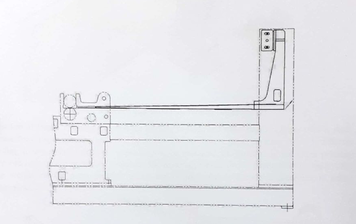

  <em>Figura 8. Diagrama Esquemático del Componente de Formación de Tubos (1)</em> 

#### Operación de los Discos de Pliegue Lateral:
De acuerdo con el molde de formación ajustado, ajuste la altura de los discos de pliegue lateral (Figura 7-7) (6 grupos en total) para que estén en la posición intermedia entre los moldes superior e inferior. Hay un tornillo en el extremo inferior del asiento de ajuste (Figura 9) para ajustar la altura de los discos de pliegue lateral. Según el tamaño de las bolsas a producir, use la rueda de ajuste en el asiento de ajuste para ajustar la profundidad de inserción de los discos de pliegue lateral. Los discos romperán el tubo de papel si se insertan demasiado profundo, y la formación del tubo será deficiente si se insertan demasiado superficialmente. Durante el ajuste de los discos de pliegue lateral, la tuerca de bloqueo en la parte frontal del asiento de ajuste (Figura 7-8) no debe estar demasiado apretada, de lo contrario, los discos no podrán ajustarse; tampoco debe estar demasiado suelta, ya que el ajuste sería inexacto. Después de ajustar, apriete la tuerca de bloqueo para evitar que la posición se desvíe debido a la holgura de la tuerca durante la operación del equipo.

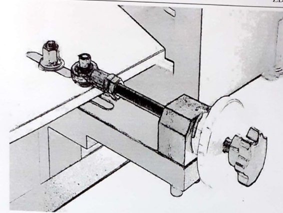

  <em>Figura 9. Diagrama Esquemática del Componente de Formación de Tubos (2)</em> 

#### Operación de las Poleas de Prensado de Papel:
La formación de los bordes grandes y pequeños del tubo de papel se realiza mediante la presión de las poleas de prensado de papel (Figura 10). La posición de la polea de prensado de papel varía según el tamaño de las bolsas de papel a producir; se puede ajustar la posición de la polea de prensado de papel aflojando la manija de ajuste en la polea. El peso en la polea de prensado de papel se puede aumentar o disminuir según los requisitos.

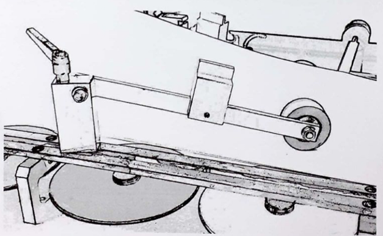

  <em>Figura 10. Diagrama Esquemático del Componente de Formación de Tubos (3)</em> 

#### Operación de la Barra de Fijación del Molde:
Cuando la línea central del tubo de papel no es idéntica a la de la máquina después de que el tubo de papel es expulsado del molde de formación, se puede fijar el molde de formación en la línea central de la máquina ajustando la tuerca en la barra de fijación del molde (Figura 11).

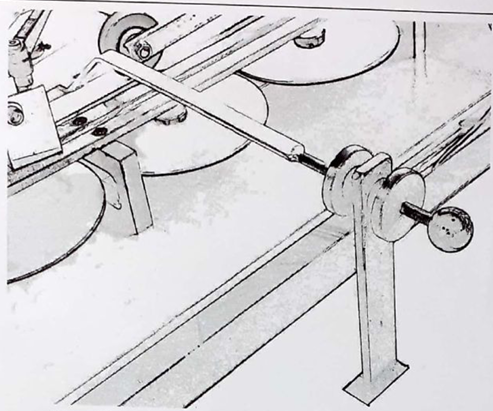

  <em>Figura 11. Diagrama Esquemático del Componente de Formación de Tubos (4)</em> 

## 4.5. Estructura Principal y Operación del Componente de la Máquina Principal

### 4.5.1. Estructura Principal del Componente de la Máquina Principal
El componente de la máquina principal (Figura 12) está constituido por el marco de la máquina principal, la parte de tracción de material, la parte de corte, la parte de la polea de transferencia, la parte de prensado de líneas, la parte de apertura de fondo, la parte formadora de fondo, la parte formadora de fondo cuadrado, la parte de pegado del fondo, la parte de inserción del fondo, la parte de plegado del fondo y la parte de control, etc.

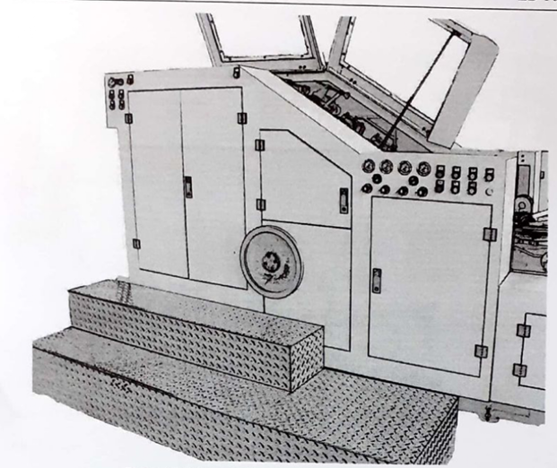

  <em>Figura 12. Diagrama Esquemático del Componente de la Máquina Principal</em> 

### 4.5.2. Operación del Componente Principal de la Máquina

#### 4.5.2.1. Operación de la Parte de Tracción del Material
La parte de tracción del material es la fuente de energía que permite transferir el papel crudo desde el desenrollado, encolado de bordes y formación de tubos hacia la máquina principal, y es impulsada por un motor servo. La parte de tracción del material está constituida principalmente por el rodillo inferior de tracción del material y la polea de presión de tracción del material. No es necesario ajustar el rodillo inferior, y el ajuste de la polea de presión (Figura 13-2) se determina según el ancho del cuerpo de la bolsa de papel: afloje el tornillo de bloqueo (Figura 13-1) en la polea de presión, luego mueva transversalmente la polea de presión para que su borde lateral externo esté ligeramente más afuera que el borde lateral del cuerpo de la bolsa de papel, y finalmente apriete el tornillo de bloqueo. La presión de las poleas de presión es controlada por dos cilindros de aire (Figura 13-3) y se ajusta mediante la válvula de presión en el panel de la máquina principal. La presión debe estar entre 45-60Pa y debe ajustarse según el tipo de papel y los requisitos.

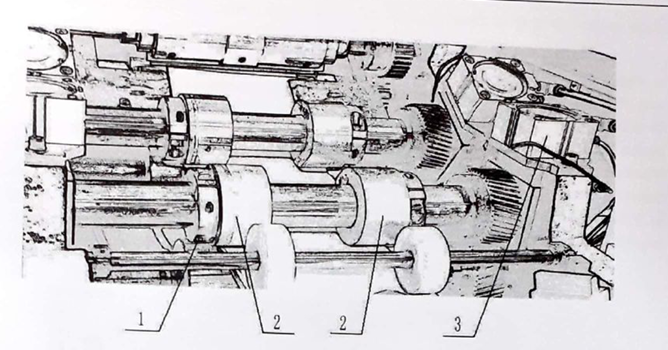

  <em>Figura 13. Diagrama Esquemático de la Parte de Tracción del Material</em> 

1. Tornillo de Bloqueo  
2. Polea de Presión de Tracción del Material  
3. Cilindro de Aire  

#### 4.5.2.2. Operación de la Parte de Corte

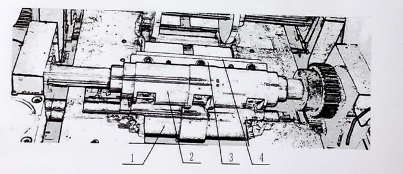

  <em>Figura 14. Diagrama Esquemático de la Parte de Corte (1)</em> 

1. Rodillo Inferior de Corte  
2. Rodillo Superior de Corte  
3. Asiento del Cortador  
4. Cortador  

##### Ajuste de la Posición del Cortador:
Afloje el bloque de bloqueo del engranaje en el rodillo superior de corte y luego gire el rodillo superior e inferior de corte para alinear el cortador en el rodillo superior con el centro de la ranura del cortador en el rodillo inferior; finalmente, apriete el bloque de bloqueo del engranaje en el rodillo superior de corte (Figura 14).

##### Ajuste de la Velocidad de Corte:
La velocidad de corte se ajusta según la longitud de corte del tubo de papel. La velocidad de rotación del cortador está controlada por dos engranajes excéntricos. Para cada engranaje excéntrico, hay un marcador en su eje largo y otro en su eje corto, respectivamente. Cuando el marcador en el eje largo del engranaje excéntrico conductor coincide con el marcador en el eje corto del engranaje excéntrico conducido, la velocidad es máxima; cuando el marcador en el eje corto del engranaje excéntrico conductor coincide con el marcador en el eje largo del engranaje excéntrico conducido, la velocidad es mínima. La posición del engranaje excéntrico se puede ajustar aflojando el tornillo en el bloque de bloqueo del engranaje excéntrico. Ajuste adecuadamente la posición del engranaje excéntrico según la longitud de corte del tubo de papel y apriete el tornillo de bloqueo (Figura 15).

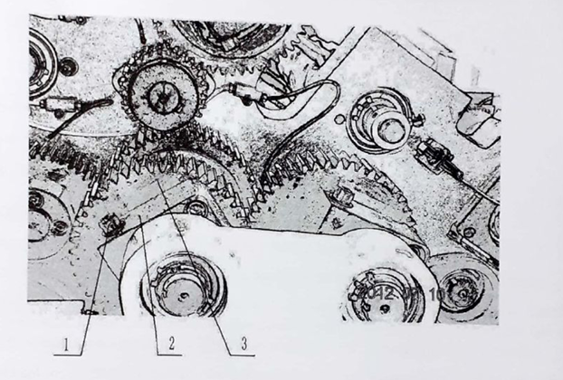

  <em>Figura 15. Diagrama Esquemático de la Parte de Corte (2)</em> 

1. Tornillo de Bloqueo  
2. Bloque de Bloqueo del Engranaje Excéntrico  
3. Engranaje Excéntrico  

#### 4.5.2.3. Operación de la Parte de la Polea de Transferencia

##### Ajuste de la Presión de la Polea de Transferencia:
La presión de la polea de transferencia se puede modificar ajustando los bloques deslizantes en sus dos lados. La presión debe ajustarse de manera adecuada, y se puede probar tirando del material a mano, bajo el principio de que no se pueda tirar. La posición horizontal de la polea de transferencia debe ajustarse según el ancho del tubo de papel. En principio, el borde de la polea de transferencia no debe tocar la parte plegada de cada borde lateral del tubo de papel.

La posición de la muesca de la polea de transferencia se puede ajustar aflojando el engranaje de ajuste (Figura 16-1).

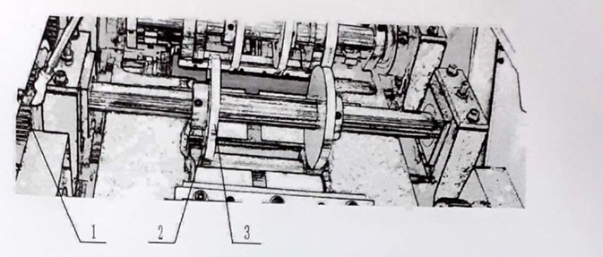

  <em>Figura 16. Diagrama Esquemático de la Parte de la Polea de Transferencia</em> 

1. Engranaje de Ajuste  
2. Polea Guía Inferior  
3. Polea de Transferencia  

#### 4.5.2.4. Operación de la Parte de Presión de Líneas
El método de ajuste para la presión y la posición horizontal es el mismo que para la polea de transferencia.

El ajuste del plectro de hierro debe realizarse según el tamaño del tubo de papel que se va a fabricar. La distancia entre dos líneas de presión es la mitad del tamaño del fondo de la bolsa de papel que se va a fabricar. El método específico de ajuste es: aflojar el tornillo en la polea de presión de líneas; la posición de la segunda línea se puede mover hacia adelante o hacia atrás hasta la dimensión necesaria; y luego apretar el tornillo suelto.

El ajuste de la distancia entre la primera línea de presión y el punto de acción de la primera abrazadera es: aflojar la tuerca de fijación en el lado de transmisión de la polea de presión de líneas; luego, la posición de la primera línea de presión se puede mover hacia adelante o hacia atrás (Figura 17).

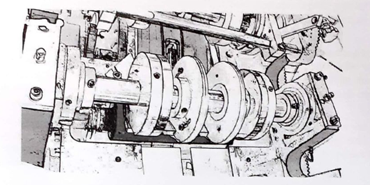

  <em>Figura 17. Diagrama Esquemático de la Parte de Presión de Líneas</em> 

#### 4.5.2.5. Operación de la Parte de Apertura de Fondo

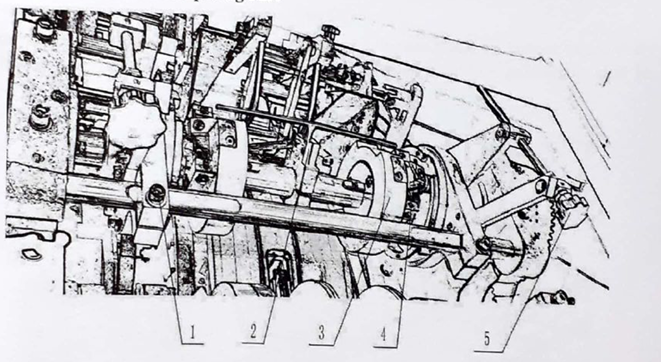

  <em>Figura 18. Diagrama Esquemático de la Parte de Apertura de Fondo</em> 

1. Tornillo de Bloqueo Horizontal en el Agitador de Apertura de Fondo  
2. Barra de Presión de Papel  
3. Agitador de Apertura de Fondo  
4. Abrazadera de Apertura de Fondo  
5. Manija de Ajuste para el Punto de Liberación de la Abrazadera de Apertura de Fondo  

La posición horizontal del agitador de apertura de fondo (Figura 18-4) debe ajustarse según el ancho del tubo de papel. Para realizar este ajuste, afloje el tornillo de bloqueo horizontal (Figura 18-1) en el agitador de apertura de fondo, ajuste la posición del agitador horizontalmente hasta que el borde del agitador coincida fundamentalmente con el borde del tubo de papel, y luego apriete el tornillo de bloqueo.

Existen varios tipos de barras de presión de papel (Figura 18-2). Seleccione la barra de presión adecuada según el ancho del tubo de papel. Asegúrese de que la altura de la barra de presión no exceda la del agitador de apertura de fondo.

El punto de liberación de la abrazadera de apertura de fondo (Figura 18-4) se puede ajustar con la manija (Figura 18-5) en dos tornillos. Gira en el sentido de las agujas del reloj para retrasar el tiempo, o en sentido antihorario para adelantarlo. El tiempo se ajusta según el ancho del fondo de la bolsa de papel. Si el tiempo es demasiado corto, la apertura del fondo no se realizará correctamente; si es demasiado largo, las esquinas del fondo de la bolsa se romperán debido a la tensión.

El método para ajustar la posición de la abrazadera de apertura de fondo es: aflojar la tuerca del engranaje en el lado de transmisión, y luego ajustar la abrazadera hacia adelante o hacia atrás hasta que esta sujete correctamente la primera línea de presión. Al hacerlo, se producirá un fondo de bolsa perfecto. Finalmente, apriete la tuerca del engranaje para la producción normal.

#### 4.5.2.6. Operación de la Parte Formadora de Fondo

Ajuste de la placa de guía lateral: seleccione la placa de guía lateral adecuada según el ancho de la bolsa. El principio de ajuste es que el ancho horizontal debe ser el mismo que el ancho de la bolsa de papel y la parte superior debe cubrir el lado inferior volteado (Figura 19).  
Ajuste de la barra de guía central: la barra de guía central no debe bloquear el fondo volteado; de lo contrario, el lado inferior no se desplegará. Si el espacio es muy pequeño, una sola barra de guía será suficiente.

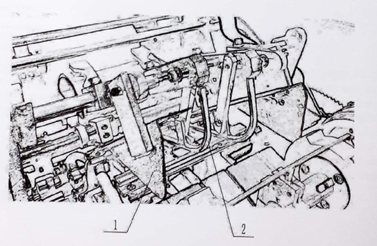

  <em>Figura 19. Diagrama Esquemático de la Parte Formadora de Fondo</em> 

1. Placa de Guía Lateral  
2. Barra de Guía Central  

#### 4.5.2.7. Operación de la Parte de Formación de Fondo Cuadrado

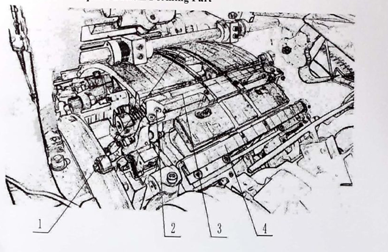

  <em>Figura 20. Diagrama Esquemático de la Parte de Formación de Fondo Cuadrado</em> 

1. Pinza Central  
2. Pinza Lateral  
3. Primera Pinza  
4. Segunda Pinza  

**Ajuste de la pinza central**: la posición de la placa base donde se instala la pinza central (Figura 20-1) puede ajustarse hacia adelante o hacia atrás aflojando el tornillo de bloqueo en la placa base. El principio de ajuste es que la distancia entre el extremo delantero de la pinza central y la primera pinza sea aproximadamente la longitud de plegado del fondo de la bolsa de papel, restando 3-4 mm (Figura 21). La altura de despliegue de la pinza central se puede ajustar aflojando el brazo de ajuste en un extremo de la pinza central. El principio de ajuste es que la altura entre la pinza central y la superficie de la polea tambor esté entre 16 mm y 19 mm. El punto de liberación de la pinza central puede ajustarse mediante dos grupos de levas en la pared lateral del lado operativo, lo que determinará la calidad de las cuatro esquinas del fondo de la bolsa.

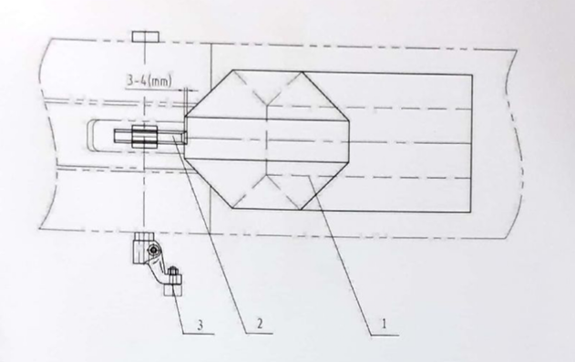

  <em>Figura 21. Diagrama Esquemático de la Pinza Central</em> 

1. Bolsa de Papel  
2. Pinza Central  
3. Brazo de Ajuste de la Pinza Central  

**Ajuste de la pinza lateral**: la posición horizontal de la placa base donde se instala la pinza lateral puede ajustarse hacia adelante o hacia atrás aflojando el bloque de bloqueo en la placa base. El principio de ajuste es que el punto de intersección entre el borde de la pinza lateral y la boca de apertura de la primera pinza debe estar 3 mm más adentro que el borde lateral más cercano de la bolsa de papel. Recuerde bloquear el tornillo de bloqueo después del ajuste. La altura de la pinza lateral se puede ajustar mediante el eje excéntrico en el asiento de montaje de la pinza lateral. El ancho de apertura de la pinza lateral debe ser mayor que el ancho de la bolsa de papel.

La primera pinza es el punto de referencia y no es necesario ajustar su posición. Solo es necesario ajustar su ancho de apertura, que generalmente es de unos 6,5 mm. El ancho de apertura de la primera pinza se puede ajustar aflojando el tornillo en el brazo de ajuste en un extremo de la primera pinza.

**Ajuste de la segunda pinza**: la distancia entre la segunda pinza y la primera pinza puede ajustarse aflojando el tornillo de bloqueo en la placa base de la segunda pinza. El principio de ajuste es que la distancia entre la segunda pinza y la primera pinza debe ser aproximadamente 12 mm más corta que el ancho del fondo de la bolsa de papel. El ancho de apertura de la segunda pinza es generalmente de unos 8 mm. Este ancho se puede ajustar aflojando el tornillo en el brazo de ajuste en un extremo de la segunda pinza (Figura 22).

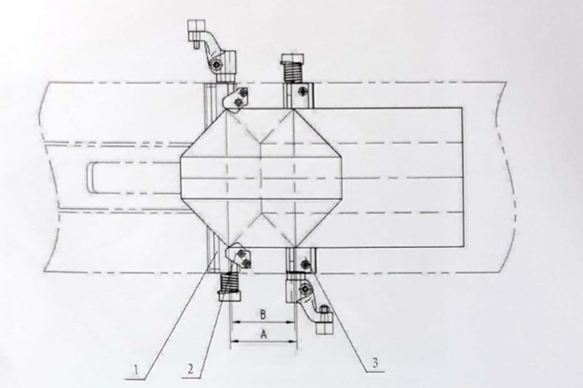

  <em>Figura 22. Diagrama Esquemático de las Pinzas para la Formación de Fondo</em> 

1. Primera Pinza  
2. Pinza Lateral  
3. Segunda Pinza  

#### 4.5.2.8. Operation of Bottom Gluing Part 
Stick rubber board for gluing before bottom gluing; the size and position of rubber board should be determined by the bag body width and bottom width of paper bag. Shear the rubber board and stick it with double sided tape onto gluing pulley (Figure 23-3). The relative position between the stuck rubber board and paper bag bottom can be changed by adjusting the gear at the end of gluing pulley. The bottom gluing can be started after the completion of adjusting the relative positions of glue dipping pulley. glue transfer pulley, gluing pulley and large hub. The quantity of glue to be applied onto the paper bag bottom should be adjusted by the gaps between different pulleys. 

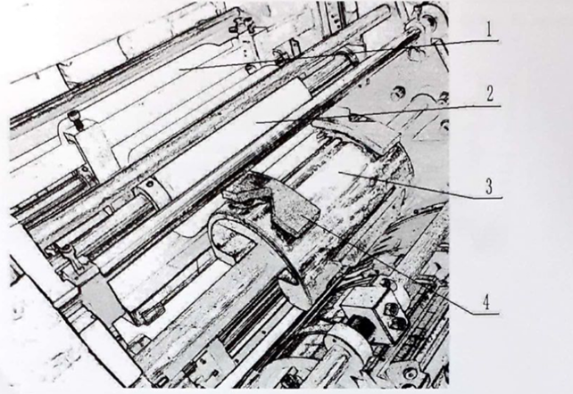

  <em>Figure 23. Schematic Diagram of Bottom Gluing Part</em> 

1. Glue Dipping Pulley 
2. Glue Transfer Pulley 
3. Gluing Pulley 
4. Gluing Rubber Board 

#### 4.5.2.9. Operation of Bottom Inserting Part 
Adjustment of the first slotting tool: tum the large hub until the opening mouth of first clamp is on the connecting line between the slotting tool shaft and the central shaft of large hub. Then loosen the locking screw on the supporting arm of the first slotting tool, and turn the first slotting tool until the cutter on the first slotting tool is inserted into the opening mouth of first clamp. Finally lock the screw to avoid loosing. 

The adjusting method for the second slotting tool is same as above. Usually it is unnecessary to adjust the first slotting tool again after it has been adjusted properly (when the position does not change), while the second slotting tool should be adjusted according to the position of second clamp. 

The insertion depth of the first slotting tool usually is approximately 12mm; the width should be adjusted according to paper bag body width and usually is 6mm shorter than the bag body width; and the two corners of the first slotting tool should be rounding. 

The insertion depth of the second slotting tool is about 13mm and the width should be larger than paper bag width. It is appropriate to use the standard slotting tool equipped with the machine and it is unnecessary to adjust it any more. 

As for the changes of paper quality, the insertion depths of slotting tools may change. So sometimes itis necessary to change the depths of slotting tools as per different paper. 

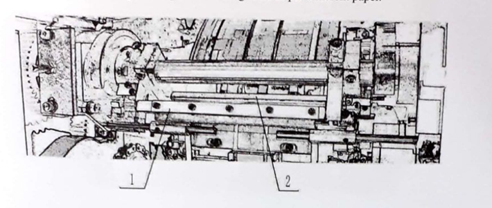

  <em>Figure 24. Schematic Diagram of Bottom Inserting Part</em> 

1. First Slotting Tool 
2. Second Slotting Tool 
#### 4.5.2.10. Operation of Bottom Folding Part 
The position of bottom folding rod can be adjusted by loosening the locking block of the chain wheel at the end of bottom inserting shaft. The adjusting principle is: when second clamp is unfolded, the bottom folding bar should be put right on the position of second clamp, so that the bag bottom can be folded. 

The bottom folding rod is combined by several short nylon bars according to a certain needed width. This width should not be larger than the distance between two protective rods. (There are two protective rods installed below slotting tools to prevent paper bag from falling down when the clamps are released.) Otherwise this bottom folding rod will break these two protective rods.

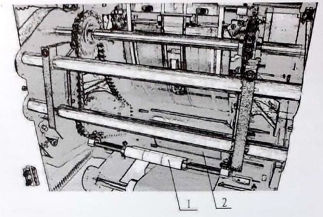

  <em>Figure 25. Schematic Diagram of Bottom Folding Part</em> 

1. Bottom Folding Bar 
2. Bottom Folding Board 

Adjustment of bottom folding board (Figure 26-3) can be made by loosening the locking screw on bottom folding board. The adjusting principle is: when bottom folding bar has pressed the second folded edge onto the bottom and left from the second folded edge, bottom folding board should touch the first folded edge and press it onto the bottom. 

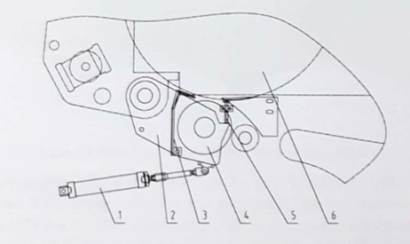

  <em>Figure 26. Side Diagram of Bottom Folding Part</em> 

1. Clutch Cylinder 
2. Clutch Board 
3. Bottom Folding Board 
4. Delivery Pulley 
5. Limit Screws 
6. Large Hub 

Adjustment of the horizontal position of delivery pulley: loosen the locking screw on delivery pulley, adjust it in the horizontal direction until the edge of delivery pulley is 3-6mm more inside than the side edge of paper bag, and finally fasten the locking screw. 

Adjustment of the pressure of delivery pulley: turn the clutch switch of delivery pulley and put the pulley down, then adjust the limit screws on the pulley to some suitable positions. Note that the limits screws on both sides of the pulley should be adjusted at the same time to make sure the balance of the pressure on both side edges of the paper bag. After the adjustment, there should be a certain resistance among the paper bag, delivery pulley and large hub, so that the paper bag cannot be pulled out easily. 

## 4.6. Main Structure and Operation of Bag Collection Component 

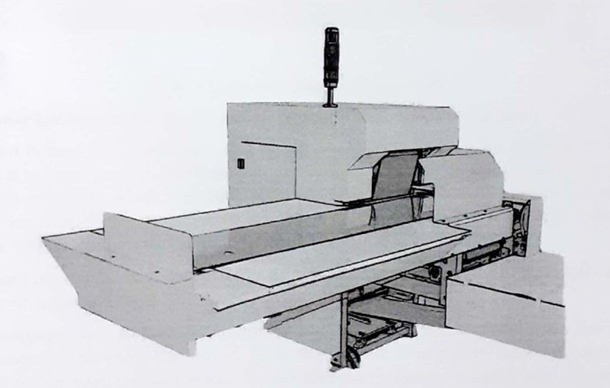

  <em>Figure 27. Schematic Diagram of Bag Collection Component</em> 

Paper bags are delivered by belt, and collected on the side workbench, which is controlled by separate servo motor. Its counting method is that accelerating the belt suddenly when a certain number of bags are collected to make an obvious gap between every two contiguous batches of bags, which is very convenient for collection. Refer to Touch Screen Operation Manual for details. 
